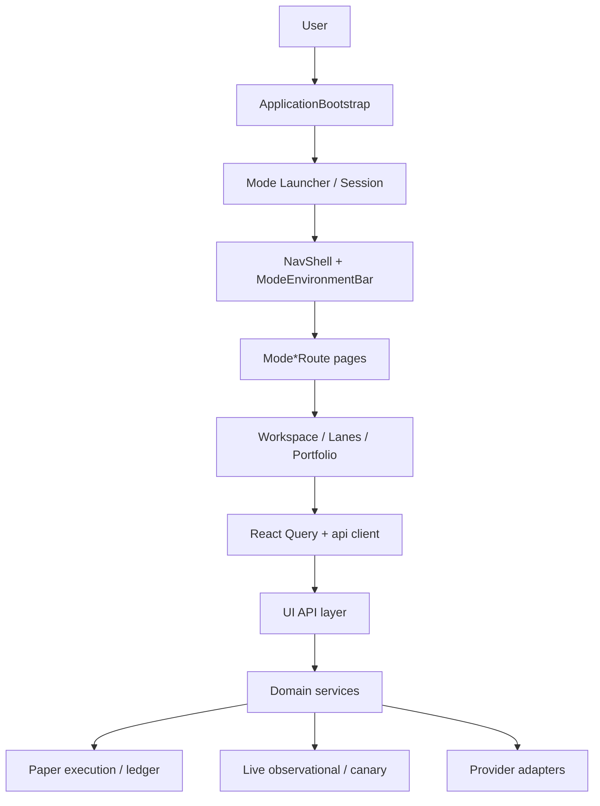

# IMP System Architecture

**Status:** Authoritative (current implementation).  
**See also:** [MODE_AUTHORITY.md](MODE_AUTHORITY.md), [PAPER_DECISION_LIFECYCLE.md](PAPER_DECISION_LIFECYCLE.md), [FRONTEND_GUIDE.md](../engineering/FRONTEND_GUIDE.md), [BACKEND_GUIDE.md](../engineering/BACKEND_GUIDE.md)

## Overview

IMP is a local-first market operating workstation:

- **Backend:** CPython 3.11 stdlib foundation (`src/market_platform_foundation/`) exposing a UI API (`tools/ui1/run_ui_api.py`, port `8766`)
- **Frontend:** React + Vite (`ui/`, port `5173`)
- **Validation:** Manifest-driven Python tests + Vitest (`tools/validate.py`, `ui/npm test`)

## End-to-end flow



## Session modes

| Mode | `data_mode` (typical) | Execution | UI pattern |
|------|----------------------|-----------|------------|
| **Demo** | `FIXTURE_REPLAY` / `HISTORICAL_CAPTURE` | `NONE` / `BLOCKED` | Read-only mode-specific pages |
| **Paper** | varies | `INTERNAL_SIMULATION` / `PAPER_ONLY` | Full Paper controls when `canUsePaperActions` |
| **Live** | `LIVE_OBSERVATIONAL` / `BROKER_DELAYED` | `NONE` / `BLOCKED` | Observational + canary links |

Frontend mode is a **session choice**; backend context must **match** (`evaluateModeContext`). Mismatch shows warning — not a substitute for backend enforcement.

## Frontend architecture

```
App.tsx
├── ApplicationBootstrap / ModeEnvironmentBar
├── NavShell (mode-aware navigation)
├── Mode*Route (Now, Portfolio, Workspace, Explore, Research, Discover)
│   ├── Demo*Page
│   ├── Paper*Page
│   └── Live*Page
├── WorkspaceRoute + lazy Mode*WorkspaceRoute (per lane)
└── Shared: *Observability, charts, mode-session, api/hooks
```

- **Lazy routes** for lanes and heavy pages (bundle budget)
- **React Query** for server state (`ui/src/api/hooks.ts`, `queryKeys`)
- **Router state** for short-lived Paper draft handoffs
- **Versioned draft state** (`paperOrderDraft.ts`) for Paper tickets

## Backend architecture

```
market_platform_foundation/
├── contracts/          # Canonical types
├── ui_api/             # HTTP projections for UI
├── paper/              # Execution, ledger, intents, projections
├── platform/           # Operating context, modes
├── providers/          # External data adapters
├── intelligence/       # BUILD lifecycle, canary, qualification
└── [lane domains]      # order_flow, options, futures, etc.
```

Request path: **UI API handler → projection/service → domain → storage/events**

## Paper execution path (summary)

Paper Command / Lane → draft + provenance → workspace cockpit → preview → submit → intent event → ledger → projection → portfolio/trace.

Full detail: [PAPER_DECISION_LIFECYCLE.md](PAPER_DECISION_LIFECYCLE.md).

## Live observational path (summary)

Provider (e.g. Moomoo OpenD) → serialized canonical events → UI projections → Live mode pages. Canary/reconciliation at `/live-canary`. **No order submission in Live mode.**

## Authority boundaries

| Layer | Responsibility |
|-------|----------------|
| Env gates (`IMP_PAPER_EXECUTION`, etc.) | Enable/disable capabilities at process start |
| Backend operating context | Authoritative execution permission |
| Frontend `canUsePaperActions` | Hide/disable UI — **not** security boundary |
| Broker adapters | Sandbox-only for P4; fail closed |

See [MODE_AUTHORITY.md](MODE_AUTHORITY.md) and [THREAT_MODEL.md](THREAT_MODEL.md).

## Data flow principles

1. Source-backed data only — no fabricated market values
2. Projections are derived; events/ledger are authoritative for Paper
3. Historical snapshot fields are immutable once persisted
4. Optional backward-compatible schema fields by default

## Key references

- Mode-specific surfaces: [completion record](../superpowers/plans/2026-08-31-mode-specific-surfaces-completion.md)
- Platformization: [roadmap](../research/PLATFORMIZATION_ROADMAP.md)
- Validation: [VALIDATION_ARCHITECTURE.md](../engineering/VALIDATION_ARCHITECTURE.md)
