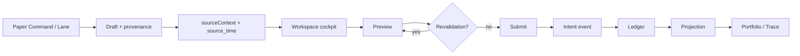

# Paper Decision Lifecycle

**Status:** Authoritative end-to-end architecture.  
**Supersedes** scattered descriptions in completion records for *current* behavior — those records remain historical evidence.

> Current architecture: this document. Historical delivery detail: completion records linked below.

## Flow



## Backend-only strategy Paper lineage

The deterministic strategy Paper loop is a backend orchestration path. It
does not add a UI route, replace the workspace submit boundary, or create a
second execution or allocation authority:

```text
StrategyDefinition
  -> StrategyMatch (MATCHED)
  -> ForecastV1 + prediction-ledger registration
  -> canonical OpportunityV1 + universal economic assessment
  -> clustering -> comparison -> capital allocation
  -> persisted allocation decision set
  -> TradeProposalV1 -> RiskDecisionV1
  -> Paper order/fill events -> portfolio accounting
  -> cumulative strategy attribution from actual fills
```

The canonical internal strategy Paper path now persists an immutable
`OrderReadyV1` record between `RiskDecisionV1` and Paper submission. Its
decision-thread `correlation_id` is carried from the strategy match through
allocation, proposal, risk, order, and fill records. A read-only unified
business trace reconstructs these records by `allocation_decision_id` through
`GET /paper/trace?allocation_decision_id=...`; the existing intent/order/fill
anchors remain supported for manual Paper orders.

The trace reports portfolio settlement and prediction settlement separately.
Portfolio settlement is the fill-driven `PositionChanged` event that powers
Paper accounting. Prediction settlement remains governed by the prediction
ledger and explicit `settle_due_and_evaluate()` calls. Neither trace
projection nor prediction settlement grants execution authority.

`CapitalAllocationDecisionV1` is an immutable IntelligenceRepository sidecar.
It freezes the account, mode, point-in-time decision, ordered allocator
candidate set, comparison/allocation constraints, rank, reason codes, and
references to the StrategyMatch, ForecastV1, opportunity, economic
assessment, cluster, and portfolio snapshot. `SELECTED`, `NOT_SELECTED`, and
`NO_ALLOCATION` remain distinct; comparator-excluded and scanner-rejected
items are not duplicated as allocation records.

Quantity facts remain separate throughout the path:

- desired allocation quantity/notional is recorded on the allocation decision;
- requested proposal quantity/notional is recorded on the trade proposal;
- approved or reduced risk quantity/notional is recorded on the risk decision;
- submitted quantity is recorded on the Paper order;
- actual filled quantity is recorded only by the Paper fill event.

Strategy attribution is a P&L sidecar, not portfolio-ledger authority. Its
materializer selects persisted Paper orders carrying backend allocation,
proposal, or risk lineage, then creates immutable cumulative snapshots whose
identity covers the exact fill set. The latest complete snapshot is selected
by coverage and time; cumulative snapshots are never summed. Account P&L
continues to come from fill-driven portfolio accounting, and reconciliation
expects the strategy slice to agree with that authoritative result.

Forecast registration and outcome settlement are independent of trade
closure. A closed Paper trade may therefore remain `NOT_DUE` until the
forecast availability cutoff. Due settlement joins the persisted
StrategyMatch, ForecastV1, prediction outcome, and latest complete trading
attribution through the governed learning boundary; any research handoff is
non-promotional and cannot promote a champion or authorize execution.

Reconstruction resolves these persisted references and Paper/portfolio
projections by account and mode. The runtime receipt is ephemeral: no
persisted story object becomes authoritative. Replays with the same
deterministic IDs and content are idempotent, while changed content for an
existing ID is an immutable conflict. Missing, expired, future, mismatched,
or unauthorized inputs stop before downstream Paper mutation.

## Stages

### 1. Attention / lane origin

- **Paper Command:** `AttentionItem` from backend projections; optional `surfaced_time` (epoch ns)
- **Workspace lane:** `createLanePaperOrderDraft` with module provenance
- **Handoff:** router state carries placeholder draft + `sourceContext`

### 2. Draft (`paperOrderDraft.ts`)

- Version-1 draft contract with optional `sourceContext`
- `correlation_id` encodes provenance (lane, attention, manual)
- `source_time` set **once** at handoff via `resolvePaperDecisionSourceTime`
- Legacy drafts without `source_time` remain valid

### 3. Workspace cockpit (`PaperDecisionCockpit`)

- Handoff panel, decision snapshot, risk context, preview status
- Order ticket embedded; `showLaneBanner=false` in cockpit
- Observability layer (`WorkspaceObservability`) unchanged below

### 4. Preview

- Server validates draft against current state
- States: `NOT_PREVIEWED`, `PREVIEWING`, `ACCEPTED`, `REJECTED`, `REVALIDATION_REQUIRED`, `AUTHORITY_UNAVAILABLE`, `ERROR`
- Accepted upstream preview **cannot** authorize submission if draft changed

### 5. Submit

- Requires current accepted preview (`confirmedRequestIsCurrent`)
- Request includes `decision_source_snapshot` (bounded fields)
- `correlation_id` preserved through intent

### 6. Intent → ledger → projection

- `build_user_order_intent` persists snapshot on intent metadata
- Ledger append-only events
- `project_orders()` → Portfolio history, execution trace

## Key identifiers

| Field | Role |
|-------|------|
| `correlation_id` | End-to-end decision linkage |
| `client_order_id` | Per-order client identifier; manual orders may equal correlation |
| `intent_id` / `order_id` | Backend persistence IDs |
| `decision_source_snapshot` | Immutable handoff context at submit time |

See [DATA_CONTRACTS.md](DATA_CONTRACTS.md) for timestamp and ID rules.

## Immutability rules

| Data | Mutable? |
|------|----------|
| `sourceContext` on draft after handoff | No — preserve `initialDraft.sourceContext` through preview/submit |
| `source_time` | No — chosen at handoff only |
| `decision_source_snapshot` on intent | No — written at submit |
| Current workspace evidence | Yes — may trigger revalidation |

## Failure behavior

- Authority loss: observe, do not submit
- Schema mismatch on snapshot: fail closed on write; degrade safely on read
- Missing `source_time`: omit display; record still valid
- Unknown provenance: degrade to `UNKNOWN` badge

## Legacy compatibility

- Orders without snapshot or `source_time`
- Manual orders (`correlation_id === client_order_id`)
- Old draft versions without `sourceContext`

## Completion records (historical)

- [Command → Workspace handoff](../superpowers/plans/2026-08-31-paper-command-workspace-handoff-completion.md)
- [Decision cockpit](../superpowers/plans/2026-08-31-paper-workspace-decision-cockpit-completion.md)
- [Portfolio history](../superpowers/plans/2026-08-31-paper-portfolio-decision-history-completion.md)
- [Source snapshot](../superpowers/plans/2026-08-31-paper-decision-source-snapshot-completion.md)
- [Source time](../superpowers/plans/2026-09-01-paper-decision-source-time-completion.md)

## Code map

| Area | Location |
|------|----------|
| Draft / snapshot builders | `ui/src/components/paper/` |
| Cockpit | `ui/src/components/paper-workspace/` |
| Backend intent | `src/market_platform_foundation/paper/` |
| Projections | `ui_api/projections.py`, `paper_projections.py` |
