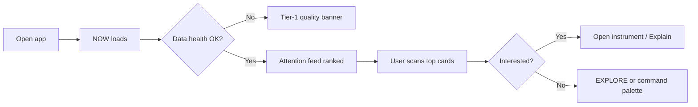

# User Flows

**Status:** `PROPOSED`

## Flow A — "I open the app. What matters?"

**Success:** User identifies top priority in <10s without chart wall.

## Flow B — "Why is NVDA highlighted?"

1. User sees attention card on NOW
2. Clicks `Why is this here?`
3. Explanation drawer shows attention reason codes
4. Optional: `Explain transition` for state change detail
5. `Open in Inspector` for evidence chain

**Context preserved:** symbol, mode, as-of time throughout.

## Flow C — "What evidence says accumulation?"

1. WORKSPACE → NVDA → Institutional Flow (or Overview alignment)
2. Evidence alignment shows `↑ LONG Moderate` for institutional
3. Click domain row → inspector EVIDENCE tab
4. Review supporting filings, large trades, flow (as entitled)
5. Note conflicting domains if any

## Flow D — "Show me the original underlying trades"

1. From CVD or large-trade card → Explain → Derivation
2. Inspector DERIVATION → input trades list
3. PROVENANCE → canonical trade IDs
4. RAW → event payload / link to source record

**Stop condition:** If trade feed unavailable, show `UNAVAILABLE` at step 1 with capability path — not empty chart.

## Flow E — "Why did the squeeze state change?"

1. Alert or Story event: `WATCH → CONFIRMED`
2. State transition panel: changed/unchanged lists
3. Inspector TIMELINE + DERIVATION
4. Each changed criterion links to evidence

## Flow F — "Replay what the platform knew at 10:37"

1. Command: `open NVDA replay 10:37` or RESEARCH → Replay
2. Context bar → `REPLAY | AS OF 10:37:00 ET`
3. Entire cockpit updates to PIT state
4. Filing/options panels show availability at T
5. Story scrubber at 10:37

## Flow G — "Compare ES and NQ at the same timestamp"

1. Open ES cockpit → enable sync Group A
2. Add NQ to linked group
3. Enter replay at timestamp
4. Split view or tab switch with locked crosshair/time

## Flow H — "Why did the model disagree with order flow?"

1. Overview evidence alignment shows conflict
2. Click conflict callout
3. Side-by-side: Model tab (MDL) vs Order Flow (DER/INF)
4. Inspector shows cutoff times, feature inputs, quality at each
5. AI sidecar: "What would invalidate model view?" (cites refs)

## Flow I — "Why did risk reject an order?" (future)

1. Portfolio alert (Tier 1)
2. RISK epistemic badge prominent
3. Inspector: violated constraint, remaining budget, rule version
4. Explicit: strategy state ≠ authorization

## Flow J — "Data is degraded. What can I still trust?"

1. Quality banner on context bar
2. Click → quality detail: affected symbols, time range, gap type
3. Per-module quality badges (PARTIAL/DEGRADED)
4. OBSERVED prices may remain GOOD while DERIVED features PARTIAL
5. Inspector QUALITY tab on any affected card

## Flow K — "Mobile alert → 30-second explanation"

1. Push notification → deep link NOW card
2. Mobile explanation drawer (summary only)
3. Evidence alignment compact
4. CTA: Open full workspace on desktop OR inspector sheet

## Usability test tasks

| # | Task | Metrics |
|---|---|---|
| 1 | Find most important current event | Time, correctness |
| 2 | Explain why it is important | Completion, path length |
| 3 | Identify supporting evidence | Errors |
| 4 | Identify contradictory evidence | Errors |
| 5 | Judge data trustworthiness | Wrong interpretation rate |
| 6 | Reach raw source | Steps, abandonment |
| 7 | Enter replay | Mode confusion errors |
| 8 | Distinguish live vs historical | Critical error = fail |
| 9 | Understand risk rejection | Confusion with strategy |
| 10 | Mobile basic investigation | Time vs desktop |
