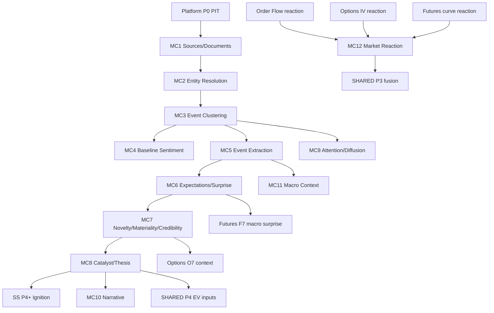

# Five-Lane Roadmap Reconciliation (Deliverable 2)

**Status:** Market Context integrated into cooperative roadmap  
**Date:** 2026-08-19  
**Lanes:** Platform + Short Squeeze + Options + Futures + Order Flow + **Market Context**

**Authority:** Extends `FOUR_LANE_ROADMAP_RECONCILIATION.md`; cooperative sequencing from `PLATFORM_COOPERATIVE_MASTER_ROADMAP.md`.

---

## Roadmap tree

```text
PLATFORM ROADMAP
│
├── Shared P0 — Correctness foundation [MOSTLY DONE]
├── Shared P1 — Market primitives [PARTIAL]
├── Shared P2 — Physical forecast P [DONE fixture]
├── Shared P3 — Cross-lane evidence fusion [DONE]
├── Shared P4 — EV / opportunity [DONE fixture]
├── Shared P5 — Portfolio intelligence [DEFERRED]
│
├── Short Squeeze SS P0–P7 [P0–P1 DONE; P2 PARTIAL; P3–P7 fixture]
├── Options O1–O11 [O1–O9 DONE fixture; O10–O11 FUTURE]
├── Futures F1–F11 [F1–F8 DONE; F9–F11 PLANNED]
├── Order Flow OF1–OF12 [OF1–OF11 IMPLEMENTED (fixture); OF12 PLANNED]
│
└── Market Context MC1–MC16 [MC1–MC12 IMPLEMENTED (fixture); MC11 macro IMPLEMENTED; MC13+ PLANNED]
```

---

## Dependency edges (Market Context ↔ lanes)



---

## Parallelizable work (no blocking)

| Track | Work | Blocked by |
|---|---|---|
| SS | SS P2 live lending, SS P7 research | Vendor auth |
| Options | O10–O11 research | O4 complete |
| Futures | F9–F10 | F6–F8 complete |
| Order Flow | OF12 advanced LOB ML | OF11 complete |
| Market Context | MC1–MC3 contracts + fixtures | P0 |
| Market Context | MC4 FinBERT bridge | MC1 (partial parallel) |
| Platform | P1 catalyst runtime | Nothing |

**Market Context does NOT block:** SS structural work, Options chain/IV, Futures contract/curve, Order Flow CVD/trade work.

---

## Ownership conflicts resolved

| Topic | Resolution |
|---|---|
| Macro event semantics | **Market Context** owns event + surprise; **Futures** owns curve/carry impact |
| Event volatility | **Options** owns IV crush / Q; Context publishes `EventEvidence` + surprise |
| Catalyst strength semantics | **Market Context** owns; SS consumes `CatalystEvidence` |
| CVD / OFI reaction | **Order Flow** owns; Context consumes for reaction confirmation |
| Physical distribution P | **Shared**; Context contributes features, does not own P |
| EV / trade recommendation | **Shared P4**; Context does not own trade signals |

---

## Shared prerequisites for Market Context

| Prerequisite | Platform phase | MC phases needing it |
|---|---|---|
| PIT timestamps | P0 | All MC |
| Provenance / quality | P0 | MC1+ |
| Instrument identity | P0 / identity contracts | MC2+ |
| Cross-lane evidence stub | P0/P3 | MC12 |
| Corporate event registry | P1 (planned) | MC6, O7, F7 |

---

## Lane phase summary (current)

| Lane | Complete (fixture/module) | Next authorized |
|---|---|---|
| SS | P0–P1, P3–P7 | P2 live lending |
| Options | O1–O9 | O10 research |
| Futures | F1–F10 | F11 advanced modeling |
| Order Flow | OF1–OF11 | OF12 advanced LOB ML |
| Market Context | MC1–MC12 | MC13 information decay |

---

## Conflict detection (Market Context milestones)

Before each MC milestone:

- [ ] Does another lane already own this interpretation?
- [ ] Is this shared platform infrastructure vs lane logic?
- [ ] Duplicating Options event-vol or Futures macro logic?
- [ ] Duplicating Order Flow reaction calculations?
- [ ] Same-timestamp circular feedback introduced?
- [ ] Missing data defaulting to neutral?
