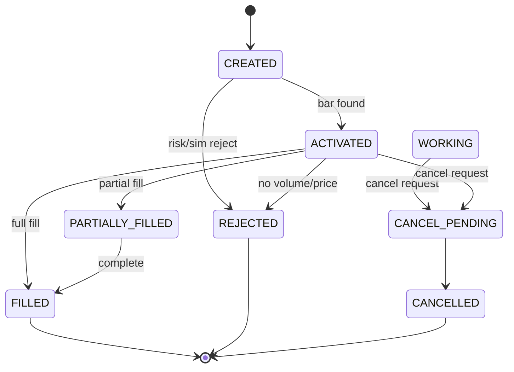

# Paper order lifecycle (P1)

Canonical states and transitions for internal simulation. BarConservativeSimulator fills synchronously in one call — there is no meaningful working-order window for MARKET bar simulation.

## States

| State | Meaning |
|---|---|
| `CREATED` | Order record initialized |
| `RISK_ACCEPTED` | Reserved for explicit risk gate (simulator uses risk decision inline) |
| `RISK_REJECTED` | Risk blocked before execution |
| `SUBMITTED` | Order accepted to execution path |
| `WORKING` | Resting/working (future LIMIT/broker adapters) |
| `ACTIVATED` | Eligible bar found after signal time |
| `PARTIALLY_FILLED` | Partial participation fill |
| `FILLED` | Full approved quantity filled |
| `CANCEL_PENDING` | Cancel requested |
| `CANCELLED` | Cancel terminal |
| `REJECTED` | Simulator or provider rejection |
| `EXPIRED` | Time/session expiry (future) |

## State machine

## Transition rules

- Terminal states (`FILLED`, `PARTIALLY_FILLED`, `CANCELLED`, `REJECTED`, `EXPIRED`) cannot transition further.
- Invalid transitions raise `ORDER_TRANSITION_INVALID` (fail closed).
- All transitions emit `OrderStateChanged` ledger events (append-only).
- Filled orders cannot be cancelled (`PAPER_ORDER_CANCEL_NOT_SUPPORTED`).

## P1 limitation

BarConservativeSimulator completes activation + fill in one synchronous `simulate()` call. Cancel is implemented for lifecycle correctness but is not operator-meaningful for immediate MARKET fills — document and test `NOT_SUPPORTED` on filled orders.

## Risk vs execution rejection

| Source | Ledger | Order state | Reason prefix |
|---|---|---|---|
| Risk | `RiskDecisionRecorded` | `REJECTED` via simulator | `RISK_*` |
| Simulator | `OrderSubmitted` + `OrderStateChanged` | `REJECTED` | `SIM_*` |
