# IMP Equity Paper Profitability Loop Design

**Status:** Approved design, implementation pending
**Date:** 2026-09-02
**Scope:** One deterministic U.S. equity-like Paper round trip

## Goal

Close the first real, deterministic, persisted runtime loop from
`StrategyDefinition` through `StrategyMatch`, governed `ForecastV1`,
canonical opportunity economics, comparison/allocation, independent risk,
Paper execution, authoritative account P&L, automatic strategy attribution,
forecast settlement, and governed learning evaluation.

The runtime is an orchestrator only. Existing Strategy, Forecast,
Opportunity, Risk, Execution, Portfolio, Outcome, Research, and Live
authorities remain authoritative.

## Non-goals

- UI changes
- Options, futures, crypto, or multi-leg proposals
- Live or broker-Paper execution
- Strategy discovery, ML training, promotion, or model-registry work
- New opportunity scoring, optimizer, Kelly sizing, or correlation model
- Event fanout daemon or broad analytics API

## Baseline classification

The actual Git root is
`integrated-market-platform`, on branch
`feat/p6-shadow-run-1-forward-validation`, with unrelated dirty work already
present. Before this increment, `tools/validate.py changed` reproduced:
`1206 tests, 9 skipped, 1 failure, 91 errors` across the `finviz`,
`platform`, `intelligence`, `ui1`, and `validation` suites.

- **Pre-existing:** the aggregate dirty-tree validation result and the
  historical direct-test-package/import assumptions documented in the work
  log.
- **Introduced by this increment:** none at design time.
- **Unknown:** exact selector-level ownership of the historical 91 errors and
  one failure because the retained aggregate output has no full trace.
  Current package import smoke checks do not reproduce a new attribution
  import cycle.

The implementation must report any changed result separately and must not
call the repository green while this baseline remains unresolved.

## Authority model

```mermaid
flowchart LR
    definition[StrategyDefinition] --> scanner[UniversalStrategyScanner]
    scanner --> match[PersistedStrategyMatch]
    match --> resolver[InjectedForecastV1Resolver]
    resolver --> bridge[OpportunityBridge]
    bridge --> engine[OpportunityEngine]
    engine --> opportunity[PersistedOpportunityV1]
    opportunity --> cluster[ThesisClusteringProjection]
    cluster --> comparator[GlobalOpportunityComparator]
    comparator --> allocator[CapitalAllocator]
    allocator --> allocation[PersistedAllocationDecision]
    allocation --> proposal[TradeProposalV1]
    proposal --> risk[PreTradeRiskEngine]
    risk --> paper[PaperExecutionOrchestrator]
    paper --> ledger[PaperExecutionLedger]
    ledger --> account[AuthoritativePortfolioAccounting]
    ledger --> attribution[FillSetAttributionMaterializer]
    resolver --> prediction[PredictionLedgerEntryV1]
    prediction --> settlement[OutcomeSettlementScheduler]
    settlement --> outcome[OutcomeV1]
    attribution --> learning[LearningJoinAndEvaluation]
    outcome --> learning
    learning --> handoff[NonPromotionalResearchHandoff]
```



The runtime service coordinates these calls and returns an ephemeral
diagnostic envelope. It does not create an alternate strategy, forecast,
opportunity, rank, risk decision, execution authority, account ledger,
outcome, or learning authority.

## Runtime contract

Add one orchestration owner at
`src/market_platform_foundation/strategy/runtime.py`. It accepts:

- a deterministic `ScanRequest`;
- the existing `UniversalStrategyScanner`;
- an injected `ForecastV1` resolver keyed by `StrategyMatch`;
- existing champion assignments, opportunity policy/context, and economic
  assessment;
- existing clustering/comparison/allocation services and constraints;
- existing Paper execution policy, quote, portfolio snapshot, and ledger;
- an optional canonical exit opportunity for the bounded round-trip test;
- existing prediction-settlement and learning policies.

The entry operation performs the following ordered work:

1. Run the scanner and persist all scanner-produced matches through its
   existing repository.
2. Require the selected match to be `MATCHED`.
3. Resolve and validate one existing `ForecastV1` with matching instrument,
   account/mode context, decision time, horizon, expiry, and PIT ordering.
4. Register the forecast with `PredictionLedgerService`; do not settle it.
5. Call `bridge_strategy_match_to_opportunity(...)`, which alone invokes
   `OpportunityEngine` and persists the assessment, economic sidecar, and
   canonical opportunity.
6. Build the existing thesis-clustering projection and one comparison
   candidate.
7. Call `GlobalOpportunityComparator` and `CapitalAllocator`.
8. Persist allocation decisions for candidates actually evaluated by the
   allocator.
9. Adapt the selected allocation to a requested `TradeProposalV1`, preserving
   the allocator desired amount and all generic lineage references.
10. Persist the proposal, independently produce and persist `RiskDecisionV1`,
    and submit only `APPROVE`/`REDUCE` through the existing Paper orchestrator.
11. Materialize attribution only from actual persisted `FillRecorded` facts.
12. Return stage IDs and explicit stop diagnostics.

The later settlement operation is independently invocable. It uses the
existing scheduler/service to settle due forecasts, then constructs a
learning join from persisted records. A completed trade with a `NOT_DUE`
forecast is valid and remains queryable.

## Durable allocation decision

Create `CapitalAllocationDecisionV1` in the opportunity allocation
persistence seam as an immutable record derived from, but not replacing,
`CapitalAllocationIntentV1`.

The record contains:

- deterministic `allocation_decision_id`;
- `decision_set_id`, derived from the complete ordered allocator input,
  account/mode, decision time, currency/scale, and allocator policy;
- `SELECTED`, `NOT_SELECTED`, or `NO_ALLOCATION` status;
- account ID, Paper mode, decision time, currency, and scale;
- opportunity, cluster, economic-assessment, StrategyMatch, and Forecast
  references;
- selected allocation-intent reference when selected;
- deterministic comparison/rank ID, rank, ordered competing opportunity
  references, and comparator version;
- portfolio/account snapshot reference;
- allocator policy/version and exact capital, buying-power, maximum-loss, and
  capital-time constraints;
- requested and allocated capital/notional amounts;
- decision reason codes and source/PIT references.

Status semantics:

- `SELECTED`: this candidate received capital;
- `NOT_SELECTED`: this candidate was valid and evaluated, but another
  allocation or budget decision won;
- `NO_ALLOCATION`: the evaluated decision set selected zero candidates.

In the zero-allocation case, records share one `decision_set_id` and common
no-allocation context. Comparator-excluded candidates are not duplicated in
this persistence layer; their reasons remain in comparator results.

Persistence extends the existing `IntelligenceRepository`,
`InMemoryIntelligenceRepository`, Mongo repository/schema, and immutable
sidecar serialization conventions. Same ID/same content is idempotent; same
ID/different content is a conflict.

## Quantity and lineage semantics

The runtime preserves these facts independently:

```text
allocation desired quantity/notional
        ↓
TradeProposalV1 requested quantity/notional
        ↓
RiskDecisionV1 approved/reduced quantity/notional
        ↓
Paper order submitted quantity
        ↓
actual filled quantity
```

Risk reduction never rewrites the allocation decision. Proposal and risk
records carry generic lineage references for allocation, StrategyMatch,
Forecast, Opportunity, cluster, economic assessment, and portfolio snapshot.
Paper `decision_source_snapshot` is supporting observability only; durable
backend records remain the semantic join.

## Exit semantics

The bounded integration test may use a separately governed canonical SELL
`OpportunityV1` produced by the existing OpportunityEngine from valid
forecast/economic inputs. The exit path uses the same proposal, risk, Paper
execution, and attribution authorities.

This does not establish a universal rule that every future position close
requires a new opportunity. Stops, expiry, risk reduction, end-of-session,
and other future close authorities remain possible.

## Incremental cumulative attribution

Attribution materialization is fill-aware and immutable:

```text
Attribution A: covered fills [F1]
Attribution B: covered fills [F1, F2]
Attribution C: covered fills [F1, F2, F3]
```

Each record's identity is derived from the allocation lineage and the exact
sorted covered fill set. `fill_refs` is the authoritative coverage set.
`materialization_semantics = CUMULATIVE` and a versioned coverage algorithm
make clear that records are cumulative snapshots, not additive P&L events.
The current strategy P&L is taken from the latest complete coverage set; a
consumer must never sum A+B+C. Replaying an unchanged fill set returns
`ALREADY_PRESENT`; later fills create a new record without overwriting older
history.

The slice calculation reuses the authoritative portfolio cost-basis
primitive. For the one-strategy happy path:

```text
authoritative account realized P&L
= latest complete strategy-attributed realized P&L
```

Manual or unknown orders do not produce strategy attribution.

## Temporal and account safety

Every stage validates:

- scanner universe, capability snapshot, match, forecast, and opportunity
  decision-time ordering;
- forecast and economics expiry;
- account/mode equality across all records;
- allocation use of the captured portfolio snapshot;
- proposal expiry and current risk state;
- fill times after proposal/decision times;
- outcome settlement only after availability cutoff;
- learning labels only after governed settlement.

Cross-account inputs fail closed. Runtime and reconstruction helpers require
account and mode scope where repository APIs support guards.

## Idempotency and reconstruction

Deterministic identities and existing immutable writes are reused for matches,
forecasts, opportunities, economic assessments, allocations, proposals, risk
decisions, and attribution. Paper order idempotency uses the existing risk
decision-derived key. Replaying the same deterministic scan against the same
Paper ledger creates no duplicate order or fill.

Add a small reconstruction helper that loads authoritative records by their
references and derives Paper order/fill/account projections from the ledger.
It returns the full join:

```text
strategy → match → forecast → opportunity → economics → decision set/rank
→ allocation → proposal → risk → order → fill → account P&L
→ strategy P&L → prediction outcome → learning evaluation
```

The helper does not persist a second “trade story” object.

## Diagnostics

The runtime result and structured stage diagnostics expose:

`scan_id`, `strategy_id`, `strategy_identity_hash`, `strategy_match_id`,
`forecast_id`, `opportunity_id`, `economic_assessment_id`, `cluster_id`,
`decision_set_id`, `comparison_id`, `allocation_decision_id`,
`trade_proposal_id`, `risk_decision_id`, `order_id`, `fill_ids`,
`attribution_id`, `account_id`, and `mode`.

Stop states are explicit: screened out, strategy rejected, forecast
unavailable, opportunity suppressed, not actionable, not allocated, risk
rejected, execution failed, filled, and closed.

## Validation

New integration tests cover:

- profitable entry/exit round trip;
- risk rejection;
- valid opportunity with no allocation;
- deterministic duplicate/replay behavior;
- cross-account rejection;
- expired opportunity;
- desired/approved/submitted/filled quantity separation;
- incremental cumulative attribution and no double counting;
- trade completion before forecast settlement;
- forecast outcome plus trading outcome join;
- learning sample/evidence fail-closed behavior and governed handoff success
  with deterministic repeated observations.

Focused existing suites remain mandatory for strategy definition/matching,
scanner, forecast, opportunity/economics, clustering, comparison/allocation,
accounting, attribution, outcomes, and learning. Then run compile checks,
whitespace/diff checks, changed validation, and the full Paper-safety
checkpoint. Final status must distinguish a dirty-baseline block from any
new regression.
