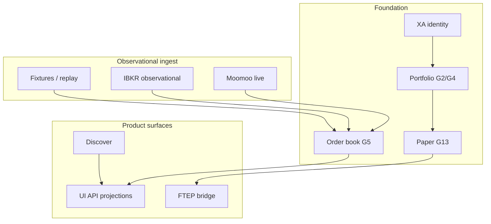

# Technical debt and architecture map

**Lane:** L | **Date:** 2026-09-12

## Debt register (top items)

| ID | Area | Description | Paydown |
|---|---|---|---|
| TD-01 | Projections | Parallel capability type systems | Unify read models |
| TD-02 | Providers | Live vs cataloged drift | Capability matrix sync |
| TD-03 | Evidence | EVIDENCE-01C deferred | Observational campaign |
| TD-04 | Options ledger | Non-authoritative over canonical | G4 follow-on |
| TD-05 | Perf | FULL suite duration | P7 budgets observe → gate |
| TD-06 | Monorepo | Foreground ahead of main | Merge/cherry-pick discipline |
| TD-07 | Research | PIT semantics scattered | PIT operator index |
| TD-08 | MATLAB | No bridge | Parquet handoff only |

## Architecture health

**Strong** in trading-correctness (G3), order book (G5), IBKR offline adapter (G6–G11). **Weak** in consolidated opportunity product and live empirical qualification.
