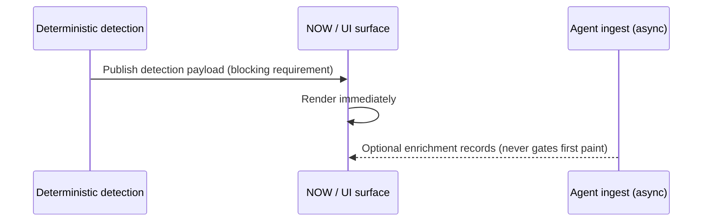

# Grok Intelligence Ingest API

**Status:** Accepted — Lane I contract (analysis-only; no trading authority)  
**Schema ID:** `intelligence/ingest/agent_enrichment/1.0.0`

## Purpose

Define the **Intelligence Ingest** plane through which external agent workers (Grok and peers) may attach enrichment to IMP opportunity surfaces **without** granting Paper/Live execution, position/risk mutation, credential access, or `MODE_AUTHORITY` changes.

This complements:

- Deterministic detection and opportunity contracts ([OPPORTUNITY_CONTRACT.md](OPPORTUNITY_CONTRACT.md))
- News AI analysis-only boundary ([NEWS_AI_INTELLIGENCE.md](NEWS_AI_INTELLIGENCE.md))
- Canonical `EvidenceV1` specialist records (`intelligence/contracts/evidence.py`)

Agent ingest records are **append-only context** keyed by `opportunity_id`, not replacements for deterministic truth.

## Non-negotiable timing

| Rule | Semantics |
|------|-----------|
| **UI NOW** | First render requires deterministic detection only |
| **Never block on Grok** | `wait_for_agent_enrichment=true` is a contract violation (`UI_BLOCKED_ON_AGENT_ENRICHMENT`) |
| **Async enrichment** | Agents may attach records after UI is live |
| **Expiry** | Every enrichment record carries `expires_at`; stale records must not override detection |

Typed gate: `evaluate_ui_intelligence_render_gate()` in `intelligence/contracts/ingest_ui_timing.py`.

## Allowed operations

| Operation | Meaning |
|-----------|---------|
| `ATTACH_EVIDENCE` | Add structured supporting material |
| `ATTACH_SOURCE_CONTEXT` | Attribute upstream sources |
| `ATTACH_CONTRADICTION` | Surface conflicting claims |
| `ATTACH_CROWD_CONTEXT` | Crowd/social listening context (read-first) |
| `SUGGEST_HYPOTHESIS` | Non-binding hypothesis text for human review |
| `UPDATE_OWN_EVIDENCE_RECORD` | Idempotent update to the same agent-owned `record_id` only |

## Forbidden mutations (fail closed)

Any request classified as below must be rejected at the ingest boundary — **not** delegated to Grok plugins:

- Paper/Live **submit**, **cancel**, **replace**
- Position, risk, strategy, or credential mutation
- `MODE_AUTHORITY` mutation

Typed `ForbiddenIngestMutation` members (must match docs):

| Paper/Live | Other |
|------------|-------|
| `PAPER_SUBMIT`, `PAPER_CANCEL`, `PAPER_REPLACE` | `POSITION_MUTATION`, `RISK_MUTATION`, `STRATEGY_MUTATION` |
| `LIVE_SUBMIT`, `LIVE_CANCEL`, `LIVE_REPLACE` | `CREDENTIAL_MUTATION`, `MODE_AUTHORITY_MUTATION` |

Typed guard: `reject_forbidden_ingest_mutation()` in `intelligence/contracts/agent_ingest.py`.

## Evidence object (`AgentEnrichmentEvidenceV1`)

| Field | Required | Meaning |
|-------|----------|---------|
| `record_id` | yes | Stable id for this agent-owned enrichment row |
| `opportunity_id` | yes | Target opportunity surface |
| `event_id` | no | Linked catalyst/event when applicable |
| `source_refs` | no | `SourceReference` tuple (provider identity preserved) |
| `retrieved_at` | yes | ISO-8601 observation time for agent retrieval |
| `agent_id` | yes | Worker identity (e.g. `grok.sentinel.v1`) |
| `bot_role` | yes | Narrow bot job (see below) |
| `skill` | yes | `skill_id` + `version` for Skills-first routing |
| `claim_type` | yes | Claim taxonomy (`SUPPORTING_EVIDENCE`, `CONTRADICTION`, …) |
| `confidence` | yes | Agent-reported score in `[0, 1]` — not calibrated probability |
| `expires_at` | yes | ISO-8601 expiry |
| `provenance` | yes | Opaque-but-auditable chain metadata (no secrets) |
| `operation` | yes | One allowed ingest operation |

Serialization: `agent_enrichment_evidence_v1_to_dict` / `from_dict`.

## Bot roles (narrow jobs → Skills first)

| Bot | Capabilities | Typical claim types |
|-----|--------------|---------------------|
| **Coordinator** | `ORCHESTRATE` | Routes work only — no direct trading narrative |
| **Sentinel** | `DETECT`, `VERIFY` | `VERIFICATION`, `SUPPORTING_EVIDENCE` |
| **CrowdWatch** | `LISTEN` | `CROWD_CONTEXT` |
| **Research Scout** | `DISCOVER` | `SOURCE_ATTRIBUTION`, `HYPOTHESIS_SUGGESTION` |
| **Skeptic** | `CHALLENGE` | `CONTRADICTION`, `CHALLENGE` |
| **Auditor** | `VERIFY` | `VERIFICATION` |

Capability matrix is enforced in tests via `bot_role_allows_capability()`.

## HTTP / API shape

| Endpoint | Method | Auth capability | Notes |
|----------|--------|-----------------|-------|
| `/intelligence/ingest/enrichment` | `POST` | `intelligence.ingest.write` | Append-only |
| `/intelligence/ingest/enrichment/{record_id}` | `PUT` | `intelligence.ingest.write` | `operation=UPDATE_OWN_EVIDENCE_RECORD` only |

Under `ENFORCED` auth, unauthenticated or VIEWER sessions receive `401`/`403` before payload parsing completes. Payload and source-ref guards are documented in [INTELLIGENCE_INGEST_BOUNDARY_SECURITY.md](INTELLIGENCE_INGEST_BOUNDARY_SECURITY.md).

Responses must not include execution tokens, order drafts, or mode flags.

## Grok workspace configuration (templates only)

Use [GROK_AGENT_WORKSPACE_CONFIG.md](../engineering/templates/GROK_AGENT_WORKSPACE_CONFIG.md). Values are templates — **never** commit secrets, broker keys, or payment plugins.

## Safety

- Grok workers remain **read-first** for GitHub, Notion, and X plugins unless the operator explicitly approves a consequential write.
- **No broker, payment, or trading plugins** in the Grok workspace template.
- Local computer execution: **Never** (cloud/agent runner only).
- Auto Review: **ON**; consequential writes: **Ask first**.
- Timezone: `America/New_York` for session-aligned narratives (display only).

## Tests

- `tests/contracts/test_grok_intelligence_ingest_contract.py` — round-trip, authority matrix, UI non-blocking gate
- `tests/intelligence/test_agent_enrichment_ingest_enforced_http.py` — ENFORCED HTTP boundary acceptance
- `tests/intelligence/test_agent_enrichment_ingest_boundary.py` — payload limits and source-ref policy

## References

- [ADR-0013](adr/0013-grok-intelligence-ingest-boundary.md)
- [MODE_AUTHORITY.md](MODE_AUTHORITY.md)
- [NEWS_AI_INTELLIGENCE.md](NEWS_AI_INTELLIGENCE.md)
