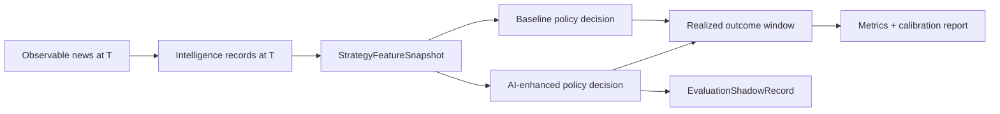

# News Strategy Evaluation Laboratory

**Status:** Accepted — professor-directed post-G15 increment (strategy evaluation stage)

## Purpose

This increment answers whether curated canonical news intelligence provides **useful predictive association** for strategy evaluation decisions — without granting execution authority.

Professor-directed progression:

```
deterministic data → filtering → AI intelligence → strategy evaluation → (later) Paper forward testing
```

This document covers **strategy evaluation and Paper-shadow laboratory** only.

## Canonical flow



Package: `src/market_platform_foundation/intelligence/news_strategy_evaluation/`

## Selected initial evaluation lane

| Field | Value |
|-------|-------|
| Lane | `FUTURES_EQUITY_INDEX` |
| Primary instrument | `ES` (CME equity index futures family) |
| Rationale | Canonical `futures/spec_registry.py` + admitted ES research fixtures; professor/donor futures motivation; MES not in IMP spec registry |
| Data | Synthetic minute-bar fixture pack for software validation |
| Limitation | MES micro contract deferred; empirical ES daily settlement bars exist but are not used for this intraday-news laboratory increment |

Architecture remains **multi-asset-compatible** (`eval-013` equity `ACME` fixture proves non-ES identity).

## Strategy decision contract

`StrategyEvaluationDecision` uses non-execution semantics:

- `POSITIVE_DIRECTIONAL_BIAS` / `NEGATIVE_DIRECTIONAL_BIAS` / `NEUTRAL`
- `normalized_directional_units` under `SIMULATION_ONLY`
- `execution_authority: false` always
- No broker account, order ID, or submit flag

## AI as feature

Structured intelligence contributes features only:

- sentiment label/score
- market impact level / horizon
- model-reported confidence (`ConfidenceKind.MODEL_REPORTED_CONFIDENCE`)

The **versioned strategy policy** maps features into evaluation decisions deterministically. Model sentiment alone never emits execution authority.

## Baseline methodology

| Policy | ID | Classification |
|--------|-----|----------------|
| Deterministic baseline | `news_deterministic_baseline@1.0.0` | catalyst + recency deterministic mapping |
| AI-enhanced | `news_ai_enhanced@1.0.0` | same core + intelligence features |
| Naive reference | `news_naive_reference@1.0.0` | always `NEUTRAL` |

`AI_INCREMENTAL_VALUE = AI_ENHANCED_OUTCOME - COMPARABLE_BASELINE_OUTCOME` (reported in `EvaluationReport.ai_incremental_delta`).

## Event-time safety

At decision time `T`:

- news: `retrieved_time <= T` (`is_observable_at`)
- intelligence: `completed_time <= T`
- market features: bar `event_time <= T`
- outcomes: data strictly after `T` — never used in feature construction

## Outcome windows

Default horizons: `5m`, `15m`, `30m`, `60m` (configurable via `EvaluationConfig`).

Outcomes record subsequent return, MFE/MAE, directional label (`UP`/`DOWN`/`FLAT`), and explicit `OutcomeQuality` when data is incomplete.

Language: **subsequent return after event** — not causal attribution.

## Shadow evaluation

`EvaluationShadowRecord` records hypothetical evaluation intent:

- observes canonical inputs
- never submits orders
- cannot enter Paper preview/submit lifecycle
- type-separated from order objects

Distinct from P6 `shadow/` prediction records (BUILD platformization). This laboratory shadow is news-strategy-evaluation scoped.

## Replay and reproducibility

`EvaluationReplayHarness` + fixture pack `tests/fixtures/news_strategy_evaluation/evaluation_replay_pack.json`:

- deterministic run/decision/outcome/report hashes
- 13 scenarios including leak-poison and overlap cases

CLI: `python tools/research/evaluate_news_intelligence.py verify-config|evaluate-fixture|replay`

## Metrics and calibration

Policy metrics: sample counts, directional accuracy, mean/median forward return, abstention rate, MFE/MAE.

Calibration: sentiment/impact/confidence buckets labeled **EMPIRICAL_CONFIDENCE_ANALYSIS** — not calibrated probability.

## Paper execution boundary

This laboratory package stops **before**:

```
preview → submit → order → fill
```

A governed **Paper forward-testing bridge** exists in `paper_forward_bridge/` (see [PAPER_FORWARD_TESTING_BRIDGE.md](PAPER_FORWARD_TESTING_BRIDGE.md)): time-locked `FORWARD_TEST` sessions may hand off to Paper preview/submit only under a **frozen** FTEP activation manifest. The preregistered campaign `FTEP-V1-001` remains `PENDING_OWNER_DECISIONS`; no empirical forward locks are authorized from this evaluation increment alone.

| Path | Role |
|------|------|
| Fixture replay / evaluation CLI (`news_strategy_evaluation`) | `SOFTWARE_FIXTURE_ONLY` software validation |
| Campaign-bound forward bridge | Prospective Paper path; requires manifest freeze and preflight `READY` |

## Safety boundary

| Authority | Status |
|-----------|--------|
| AI execution authority | **NONE** |
| Shadow order authority | **NONE** |
| Paper order submission | **NONE** |
| Live order submission | **NONE** |
| Broker calls in evaluator path | **NONE** |
| MODE_AUTHORITY changes | **NONE** |
| Portfolio mutation | **NONE** |

## Professor traceability

| Professor directive | Canonical implementation |
|---------------------|-------------------------|
| Look at outcome, revise, iterate | recorded intelligence → versioned policy → realized outcome → baseline comparison → evaluation evidence |
| Publication time matters | strict as-of/event-time evaluation |
| Use Claude | governed intelligence feature (recorded inferences evaluated; no live rerun in tests) |
| Forward test | laboratory + shadow foundation for later Paper bridge |

No automatic prompt mutation or self-modifying strategy.

## Known limitations

- `SOFTWARE_FIXTURE_ONLY` empirical path for this increment
- No durable evaluation persistence (in-memory repositories)
- Live-time shadow observation path not validated (market-hours/external blocker acceptable)
- Claude live validation: `CLAUDE_LIVE_VALIDATION_NOT_RUN_EXTERNAL_CREDENTIAL_BLOCKER`
- No profitability claims from software tests

## INT-012

**PARTIALLY_INTEGRATED** — adapted: deterministic filtering, governed intelligence, replay, outcome evaluation. Donor executor/Tradovate/MES trader remains **NOT INTEGRATED**.

## Related

- [NEWS_EVENT_FOUNDATION.md](NEWS_EVENT_FOUNDATION.md)
- [NEWS_AI_INTELLIGENCE.md](NEWS_AI_INTELLIGENCE.md)
- [ADR-0012](adr/0012-news-strategy-evaluation-laboratory.md)
