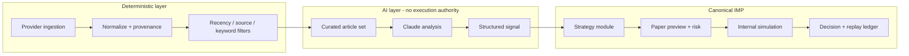

# Claude Code News — forensic audit (2026-09-09)

**Donor ID:** SRC-006  
**Local path:** `Claude Code News/` (gitignored, read-only reference)  
**Audit type:** Professor-directed post-G15 increment — audit and integration assessment only  
**Auditor context:** Code-path trace, static analysis, IMP comparison; no donor execution

---

## 1. Executive summary

The captured **Morning Brief** (`news-morning-brief`) is a **standalone macOS Node.js daemon** that:

1. Polls RSS, Telegram, Reddit, optional Twitter, and TradingView wire news into an **8-hour in-memory buffer**
2. At **9:25 AM ET**, filters headlines (recency tiers → source trust → keywords), calls **Claude Sonnet 4.6** once, and optionally places **one MES bracket trade/day** via **Tradovate DOM automation** through TradingView CDP
3. Manages exits with a **trailing R-multiple ladder** and logs decisions for offline replay (`reconstruct.mjs`)

**Lucas Bichara** is **CONFIRMED** as the email-thread transfer contributor for this material. **File-level authorship is UNKNOWN** — no `.git`, no author metadata, no signed commits.

**No donor code belongs in canonical IMP.** The donor’s valuable patterns are **filter ordering**, **publication-time tiering**, **deterministic preprocessing before AI**, **shadow/replay tooling**, and **honest performance documentation** — not Tradovate CDP execution or macOS launchd coupling.

**Performance claims in the donor README are not independently verified** in this workspace (no `logs/` directory). The donor itself documents that out-of-sample results were negative and that no proven edge exists.

**Recommended next increment:** Implement canonical IMP **deterministic news/event ingestion + filtering foundation** (Paper-only, provider-agnostic) before any Claude strategy loop.

---

## 2. Accepted baseline verification

| Check | Expected | Actual | Match |
|-------|----------|--------|-------|
| Parent `main` SHA | `bf0715fdfca91b278e5c30edb6ff6707c448084d` | `bf0715fdfca91b278e5c30edb6ff6707c448084d` | Yes |
| Branch | `main` | `main` | Yes |
| Donor path | `Claude Code News/` local-only | Present, `.gitignore` line 72 | Yes |
| Donor modified | No | Not tracked; audit did not modify donor | Yes |
| G15 acceptance | Intact | No repo sync required for this increment | Yes |

Short-squeeze child state (`fix/frozen-followups` @ `9de7b2fc`) was not re-verified in this increment; it does not affect donor audit scope.

---

## 3. Provenance findings

### 3.1 Lucas Bichara relationship

| Fact | Confidence |
|------|------------|
| Lucas Bichara (`ljb6293@psu.edu`) sent professor material identified as Claude Code News (2026-09-06) | **CONFIRMED** (email-derived; recorded in SRC-006 registry) |
| Professor forwarded as "This is Future Project" | **CONFIRMED** (email-derived) |
| Lucas Bichara authored every file | **UNKNOWN** |
| Package self-identifies author | **No** — `package.json` has no author field |

### 3.2 Additional contributors discovered

None at file level. Code comments reference iterative development (bugs dated 2026-07 through 2026-08) but name no individual.

### 3.3 Contradictions with email-derived provenance

None found in repository artifacts. Prior reconciliation correctly registered SRC-006 and INT-012 (NOT_YET_INTEGRATED).

### 3.4 Lucas Heller / "Lucus" false lead

No attribution of this donor to Lucas Heller. GridIQ/DS-340W mistaken-donor records remain superseded and unrelated to SRC-006.

---

## 4. Artifact inventory summary

**Full inventory:** [CCN_ARTIFACT_INVENTORY.json](CCN_ARTIFACT_INVENTORY.json)

| Category | Count | Notes |
|----------|------:|-------|
| Source/config/docs (excl. `node_modules`) | 58 | Complete JS/MJS tree |
| `node_modules/` (local only) | ~3457 | Not part of donor source census; gitignored |
| `logs/` | 0 | Expected runtime output absent — blocks replay verification |
| `.env.example` | 0 | Referenced in README but missing from capture |
| Git metadata | 0 | No history, branches, or remotes |
| Tests | 0 | No unit/integration test suite |
| Databases | 0 | In-memory headline store only |

---

## 5. Architecture reconstruction (evidence-backed)

### 5.1 Data flow

```
[RSS / Telegram / Reddit / Twitter*] ──poll──► NewsMonitor._emit()
[TradingView news-mediator via CDP]  ──poll──► TvNewsMonitor._emit()
                        │
                        ▼
              storeItem() — 8h rolling _store (in-memory)
                        │
         9:25 ET SIGUSR1 / 60s timer fallback
                        ▼
              morning_brief.runBrief()
                 ├─ dedupe + sort by publishedAt
                 ├─ focusFilter() [if BRIEF_FOCUSED=1]
                 ├─ tier: pre-open (09:00–09:25 ET) > wire > secondary
                 ├─ getDailyContext() — optional MES trend from TV bars
                 └─ callClaude() — Anthropic Messages API
                        │
            confidence < BRIEF_MIN_CONF or neutral → stop
                        │
                        ▼
              executeTrade() — Tradovate via broker_ui.js (CDP)
                 ├─ reaction check vs headline publishedAt
                 ├─ bracket: fixed $1500 stop (30pt), 1.5R target
                 └─ manageTrade() — trailing ladder + 120min time exit
                        │
                        ▼
              shadow_log.recordDecision() + JSONL trade logs
```

\*Twitter requires `TWITTER_BEARER_TOKEN`.

### 5.2 What was removed from parent build

`main.mjs` documents removal of five other predictors (`pipeline.mjs` news-spike classifier, extra briefs, calendar reactor, FOMC trader). This standalone package keeps **only the morning brief** but retains the **full RSS feed list** for coverage.

### 5.3 Agent loop assessment

| Stage | Implemented | Automated |
|-------|-------------|-----------|
| Continuous ingestion | Yes | Fully automated polling |
| Deterministic filter | Yes | `focus.mjs` + tiering |
| AI analysis | Yes | Single daily Claude call |
| Signal/decision | Yes | JSON direction + confidence |
| Execution | Yes | CDP Tradovate (live-gated) |
| Outcome measurement | Partial | Shadow snapshots + trade JSONL; algo_shadow counterfactual |
| Prompt/logic feedback | Manual | `reconstruct.mjs` for offline A/B; no auto-tuning loop |

**Verdict:** Semi-automated **daily decision loop**, not a full closed-loop self-improving agent. Professor’s “closed-loop ecosystem” is **aspirational** relative to donor code; measurement tooling exists but iteration is human-driven.

### 5.4 Trading / strategy facts

| Parameter | Value |
|-----------|-------|
| Instrument | MES only (pinned in focused prompt) |
| Frequency | Max 1 trade/day |
| Default size | 10 contracts (`NEWS_QTY`) |
| Stop | Fixed $1500 / 30pt (`NEWS_SL_FIXED_USD`) — model `stop_pts` logged but discarded |
| Target | 1.5R (45pt) when `NEWS_TP_CAP_USD=0` |
| Hold | 120 minutes |
| Session | US cash open bias (9:30–11:30 ET forecast window) |

### 5.5 Forward testing mechanics

- **Live path:** Real Tradovate fills when `BROKER_LIVE=1` and TradingView ticket ready
- **Dry run:** Default — `setDryRun(true)` unless `BROKER_LIVE=1`
- **Replay:** `reconstruct.mjs` rebuilds headline inputs from `logs/news_scan_*.log`; requires scan logs not present here
- **Counterfactual P&L:** `scheduleAlgoShadow()` simulates ladder on 5-min bars post-trade
- **Honest limits:** README explicitly states OOS window lost money, n=31, confidence uncalibrated, Claude non-determinism ~$3,750 spread on identical inputs

---

## 6. Event-time / news publication analysis

### 6.1 Timestamp fields

| Timestamp | Source | Authoritative for |
|-----------|--------|-----------------|
| `publishedAt` | RSS `pubDate`, Telegram `datetime`, Twitter `created_at`, TV `published` (epoch s) | Headline event time |
| Ingestion time | Implicit `Date.now()` at poll | Retrieval time (not stored on NewsItem) |
| `storeItem` age filter | `Date.now() - publishedAt` | Rolling 8h window membership |
| Brief fire time | `etMinutes()` / SIGUSR1 | Decision time |
| Pre-open tier | `isPreOpen()` — 09:00–09:25 ET **today** | Recency ranking in prompt |
| Executor reaction | Bar at or before `publishedAt` | Late-entry skip (`REACTION_MAX_R`) |
| Order/fill | Broker DOM / estimated P&L | Execution time (not exchange-native) |

### 6.2 Timezone handling

- **Good:** `morning_brief.mjs` uses `Intl.DateTimeFormat` with `America/New_York` for fire window and pre-open tier (DST-safe)
- **Risk:** `getDailyContext()` uses hardcoded `UTC-4` offset for RTH bar grouping — **incorrect during EST** (documented bug class elsewhere in file comments)
- **RSS fallback:** Missing `pubDate` → `new Date()` (retrieval time masquerading as publication time)

### 6.3 Professor directive alignment

| Professor order | Donor support |
|-----------------|---------------|
| Treat news as catalyst | Yes — macro/index keyword filter |
| Preserve publication time | **Partial** — `publishedAt` used for sorting, tiers, reaction check; not persisted as first-class provenance record |
| Deterministic preprocessing before AI | **Yes** — filter + tier before Claude |
| Recency → source → keywords → AI | **Mostly yes** — tiering adds pre-open/wire before keyword-secondary; not a strict 2–3 day global cutoff (uses 8h window) |
| Feed AI only selected inputs | Yes — `focusFilter` reduces ~300→~30 |

### 6.4 Leakage and bias audit

| Risk | Finding |
|------|---------|
| Look-ahead in replay | `reconstruct.mjs` uses headlines only seen before fire time + restart awareness — **sound design** when logs exist |
| Wire feed replay gap | TV wire feed from 2026-08-14 **cannot** be reconstructed from scan logs predating it — README admits UNMEASURED tier |
| Selection bias | README documents in-sample vs OOS split; donor author warns against trusting in-sample window |
| Survivorship | Not applicable to futures brief |
| Claude non-determinism | **Material** — identical inputs vary ~$3,750 across replays |
| Revised headlines | TV dedup uses story `id` — in-place revision not re-emitted (good) |
| Missing pubDate → now | **Leakage risk** for feeds without dates |

**Verdict:** Publication time is **meaningfully used** but not with IMP-grade `source_time` / `available_time` contracts. Code alone cannot prove historical tests were leak-free without the absent log artifacts.

---

## 7. News source / catalyst analysis

### 7.1 Actual integrated sources (donor)

| Tier | Sources |
|------|---------|
| Official | Truth Social (Trump feed), Fed press/speeches/FOMC |
| Semi-official RSS | Bloomberg, CNBC Economy/Breaking, MarketWatch/Dow Jones, Yahoo/AP, WSJ Markets, OilPrice |
| Social | Telegram (2 channels), Reddit (r/worldnews, r/economics), Twitter (optional, 15 accounts) |
| Wire via TV | Reuters, Dow Jones, dpa-AFX, Trading Economics (symbol-filtered MES) |

**Not integrated:** Benzinga, SEC EDGAR, FDA, PR Newswire, Accesswire, Globe Newswire as first-class feeds (professor examples for future IMP design).

### 7.2 Catalyst keywords (donor `focus.mjs`)

Macro policy (Fed, rates, CPI, payrolls), index/market terms, strategist forecasts, tariffs/war/oil/OPEC, mega-cap tickers. DROP patterns remove retirement/personal-finance/CEO appointment noise.

### 7.3 Professor vs donor gap

Professor’s 2–3 day recency preference maps to donor’s **8-hour intraday window** — stricter for opening brief, not general catalyst research. IMP should support **strategy-configurable recency TTL**, not copy the 8h constant.

---

## 8. AI / Claude findings

### 8.1 What Claude actually does

| Use | Model | When |
|-----|-------|------|
| Morning direction call | `claude-sonnet-4-6` | Once per trading day (~9:25 ET) |
| API health ping | `claude-haiku-4-5-20251001` | Preflight (~9:15 ET) |
| MCP chart tools | Via `src/server.js` | Optional; separate from trading daemon |

**API:** Direct HTTPS to `api.anthropic.com/v1/messages` — not Claude Code CLI, not Agents SDK.

**Output:** Structured JSON (`direction`, `confidence`, `instrument`, `stop_pts`, `reason`) parsed from free text with brace extraction.

### 8.2 What is only described

- Multi-agent orchestration
- Automatic prompt refinement from measured results
- Calibrated confidence (explicitly **not** calibrated in README)

### 8.3 Token and reliability controls

- `BRIEF_MAX_TOKENS=700` required — lower values cause parse failures logged as false "NEUTRAL 0%"
- 45s API timeout
- No retry loop on Claude failure (alerts via iMessage/notify)

---

## 9. Forward-testing / performance evidence review

| Claim | Classification | Evidence |
|-------|----------------|----------|
| Jun 30–Aug 11 2026 +$12,497.50 (31 signals combined window) | **PARTIALLY VERIFIED** | Documented in donor README with methodology; **no log files in workspace** to reproduce |
| Aug 12–28 OOS −$2,536.80 (PF 0.43) | **PARTIALLY VERIFIED** | README table + replay methodology described; logs absent locally |
| Professor ~$5,000/week after news timing | **UNVERIFIED** | No code, account statements, or logs in repo |
| "No proven edge" (donor author's conclusion) | **CONFIRMED** | README honest-limits section; aligns with OOS loss |
| Ladder contributes most P&L vs direction | **PARTIALLY VERIFIED** | Code implements ladder; dollar attribution only in README |
| Focused prompt edge over baseline | **CONTRADICTED** (by donor author) | README: like-for-like baseline ahead at 30pt stop |
| Software validation = profitability | **N/A** | Correctly not claimed |

---

## 10. Security / execution review

| Path | Classification |
|------|----------------|
| `broker_ui.js` order placement | **live_capable** — `DRY_RUN=true` default; `setDryRun(false)` when `BROKER_LIVE=1` |
| `preflight.mjs` | **simulation** — drives ticket, never submits |
| `main.mjs` default (`npm start`) | **simulation** — no `BROKER_LIVE` |
| `npm run live` | **live_capable** |
| CDP `connection.js` | **observational** for data; enables UI automation |
| `install.sh` / launchd | **destructive locally** — installs agents, writes plists |
| Credentials | Expected in `.env` (`ANTHROPIC_API_KEY`, optional `TWITTER_BEARER_TOKEN`) — **not present in tree** |

**Audit execution policy:** No donor code executed beyond `node --check` syntax validation. No API keys, no TradingView, no broker activity.

**IMP safety alignment:** Donor live path bypasses IMP Paper lifecycle, preview, risk authority, and mode gates — **must not be wired directly into IMP Live or Paper submit paths**.

---

## 11. Software quality findings

### 11.1 Architecture

- **Strengths:** Clear module split (`monitor` / `focus` / `morning_brief` / `executor`); shared `focus.mjs` for live+replay parity; `verify_config.mjs` boot assertions; extensive inline incident documentation
- **Weaknesses:** Monolithic daemon process; in-memory state lost on restart; macOS/TradingView/Tradovate hard coupling; no provider abstraction layer

### 11.2 Correctness risks

- DOM selector drift (documented twice breaking production)
- Silent TV news failure when logged out
- `getDailyContext` UTC-4 hardcode during EST
- `dailyPnl` no calendar rollover
- Missing `pubDate` → `now()` timestamp corruption

### 11.3 Testing

- **No automated tests**
- Manual preflight + `reconstruct.mjs validate` as operational QA
- Shadow log intended as empirical dataset

### 11.4 Dependencies

- Minimal npm deps (CDP + MCP SDK), Node ≥18
- Platform: **macOS only** (launchd, Shortcuts, `say`/`osascript`)

### 11.5 Observability

- Scan logs, trade JSONL, shadow JSONL, iMessage alerts
- Good operational logging discipline; poor cross-machine portability

---

## 12. IMP comparison

| Capability | Donor | Canonical IMP | Verdict |
|------------|-------|---------------|---------|
| News ingestion | RSS/social/TV poll | Finviz + NewsAPI + Finnhub (`news/`) | **BETTER IN IMP** (provider abstraction) — missing wire-tier and social |
| Publication/event time | `publishedAt` on items | `published_time`, `event_time`, `available_time` in market context contracts | **BETTER IN IMP** |
| Recency/source/keyword filter | `focus.mjs` tiers | Partial (`market_context/catalyst.py`) | **POTENTIALLY BETTER IN DONOR** for intraday tiering pattern |
| Claude/AI call | Direct Anthropic HTTP | Intelligence routing, MRA assistant (separate) | **COMPLEMENTARY** — IMP has governance; donor has strategy prompt |
| Futures execution | Tradovate CDP | Paper internal sim + IBKR observational | **BETTER IN IMP** (safety) — different broker model |
| Bracket/ladder | Custom executor | Paper order lifecycle + risk | **ADAPT** concepts only |
| Replay/shadow | `reconstruct.mjs`, shadow_log | Intelligence replay, fixture harness | **COMPLEMENTARY** |
| Multi-asset | MES only | Equities, futures, options, bonds, commodities lanes | **BETTER IN IMP** |
| Mode authority | `BROKER_LIVE` env flag | MODE_AUTHORITY, LIVE-001 blocked | **BETTER IN IMP** |
| Agent closed loop | Partial | Intelligence BUILD roadmap | **MISSING FROM IMP** (by design until this program) |

**INT-012 status unchanged:** NOT_YET_INTEGRATED (zero identifier matches in IMP code).

---

## 13. Reuse decision matrix

| Component | Donor path | Decision | IMP destination | Risks |
|-----------|------------|----------|-----------------|-------|
| RSS/Telegram poll implementation | `monitor.mjs`, `sources.mjs` | **REFERENCE ONLY** | Future `news/ingestion` adapters | Scraping fragility, ToS, no contracts |
| TV wire poller | `tv_news.mjs` | **REFERENCE ONLY** | Provider adapter spec only | TV session coupling; not portable |
| Keyword/catalyst filter | `focus.mjs` | **ADAPT** | `news/filter` + strategy rules registry | Overfit regex lists |
| Pre-open/wire/secondary tiering | `morning_brief.mjs`, `focus.mjs` | **ADAPT** | Filter layer ranking policy | UNMEASURED in donor |
| Focused Claude prompt | `focus.mjs` | **REFERENCE ONLY** | Prompt version store (not copy verbatim) | Non-determinism; unproven edge |
| Anthropic HTTP client | `morning_brief.callClaude` | **REJECT** | Use IMP intelligence inference boundary | Bypasses governance |
| Tradovate CDP executor | `broker_ui.js`, `executor.mjs` | **REJECT** for IMP | Paper sim only | Live-capable; DOM fragility |
| Trailing ladder semantics | `executor.mjs` | **ADAPT** | Paper bracket policy / research harness | P&L unverified |
| Shadow decision log | `shadow_log.mjs` | **ADAPT** | Intelligence decision ledger | Schema alignment needed |
| Scan log reconstruction | `reconstruct.mjs` | **ADAPT** | Event-time replay tooling | Requires canonical log schema |
| Config verification | `verify_config.mjs` | **ADAPT** | Strategy config manifest + boot gate | — |
| MCP chart server | `src/server.js` | **REFERENCE ONLY** | Optional dev tooling | Out of scope |
| launchd / iMessage | `launchd/*`, `notify.js` | **REJECT** | IMP scheduler + observability | macOS-only |
| README honest-limits discipline | `README.md` | **REUSE** (practice) | EVIDENCE / qualification docs | — |
| P&L tables in README | `README.md` | **REFERENCE ONLY** | Not evidentiary | UNVERIFIED locally |

---

## 14. Proposed canonical IMP integration architecture

Implement as **layers on existing IMP contracts**, not a parallel Node daemon.

### Layer 1 — Deterministic news/event ingestion

- Provider-agnostic adapters behind `news/providers.py` pattern
- Canonical fields: `article_id`, `source_id`, `headline`, `body_snippet`, `published_time` (event), `retrieved_time`, `url`, `symbols[]`, `provenance`
- Storage: append-only event log + replay index (Demo-safe fixtures first)
- **No AI in this layer**

### Layer 2 — Filter chain (professor order)

1. **Recency** — strategy TTL (e.g. 8h opening brief vs 72h squeeze catalyst)
2. **Source trust** — catalog per asset class (wire > official > semi-official > social)
3. **Catalyst keywords / event types** — registry per strategy (reuse `market_context` event taxonomy)
4. **Deduplication** — URL + normalized headline fingerprint (IMP aggregator already partial)

### Layer 3 — AI analysis (curated input only)

- Route through intelligence inference boundary (not raw HTTP from strategy code)
- Claude evaluation with **versioned prompts**, structured output schema, token limits
- Log: prompt hash, model id, input article ids, output, latency — **no broker authority**

### Layer 4 — Strategy (Paper only)

- Morning futures brief lane (MES) as **one strategy module** among multi-asset set
- Consumes filter output + market context; emits `StrategySignal` (direction, confidence, rationale)
- **No Tradovate** — use IMP Paper internal simulation + existing preview/risk path

### Layer 5 — Evaluation

- Event-time-safe replay using `published_time` + `available_time` discipline from DATA_CONTRACTS
- Compare prompt/model versions; report calibration (shadow report pattern)
- Explicit separation: software correctness (IMP validation pyramid) vs strategy P&L evidence (EVIDENCE lanes)

### Layer 6 — Execution boundary

- Paper/simulation only for this program
- Live remains observational; LIVE-001 blocked
- Any future broker adapter requires separate ADR + authorization



---

## 15. Remaining unknowns / blockers

1. **Absent runtime logs** — cannot reproduce README P&L or validate `reconstruct.mjs` fidelity in this workspace
2. **Missing `.env.example`** in captured tree — config contract incomplete in artifact
3. **File-level authorship** — unresolved
4. **External git remote** for SRC-006 — none found
5. **Professor wire-source requirements** (PR Newswire, Benzinga, SEC, FDA) — IMP provider contracts not yet defined for these
6. **Whether Tradovate+TV was professor’s intended execution model** or reference-only — OPEN (WS05/07 carryover)

---

## 16. Next recommended implementation increment

**Goal (Composer-ready):**

> Implement canonical IMP deterministic news/event ingestion foundation: provider-agnostic article model with `published_time` and `retrieved_time`, source-trust catalog stub, recency + keyword filter chain (no AI calls), fixture-based replay tests, and Paper-only API surface — adapting tiering concepts from SRC-006 without copying donor code or enabling broker execution.

**Suggested first deliverables:**

1. `ArticleEvent` contract + JSON schema aligned with DATA_CONTRACTS
2. Filter pipeline interface (recency → source → keywords)
3. Fixture pack from public-domain/sample headlines
4. Replay test proving no article with `published_time` after decision time enters the curated set
5. ADR for news-catalyst program boundary (AI analyzes; does not ingest raw web)

---

## 17. Repository changes (this increment)

| File | Action |
|------|--------|
| `docs/audits/post-g15-professor-directed/README.md` | Created |
| `docs/audits/post-g15-professor-directed/CCN_FORENSIC_AUDIT_2026-09-09.md` | Created |
| `docs/audits/post-g15-professor-directed/CCN_ARTIFACT_INVENTORY.json` | Created |
| `docs/engineering/WORK_LOG.md` | Updated |
| `Claude Code News/**` | **Not modified** |

---

## 18. Validation performed

| Command | Result |
|---------|--------|
| `git rev-parse HEAD` | `bf0715f…` — matches accepted baseline |
| `git check-ignore Claude Code News/README.md` | Ignored as expected |
| `node --check` on `main.mjs`, `executor.mjs`, `monitor.mjs`, `reconstruct.mjs` | Pass (Node v22.13.0) |
| Donor execution (npm start/live/preflight) | **Not run** — requires macOS, TV, API keys |
| IMP test suite | **Not run** — documentation-only changes per repository policy |
